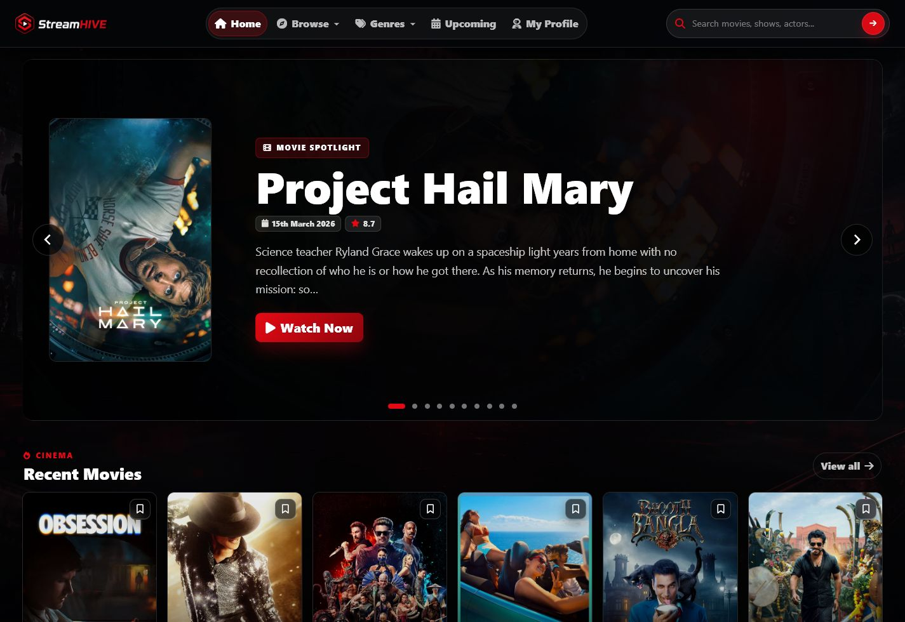
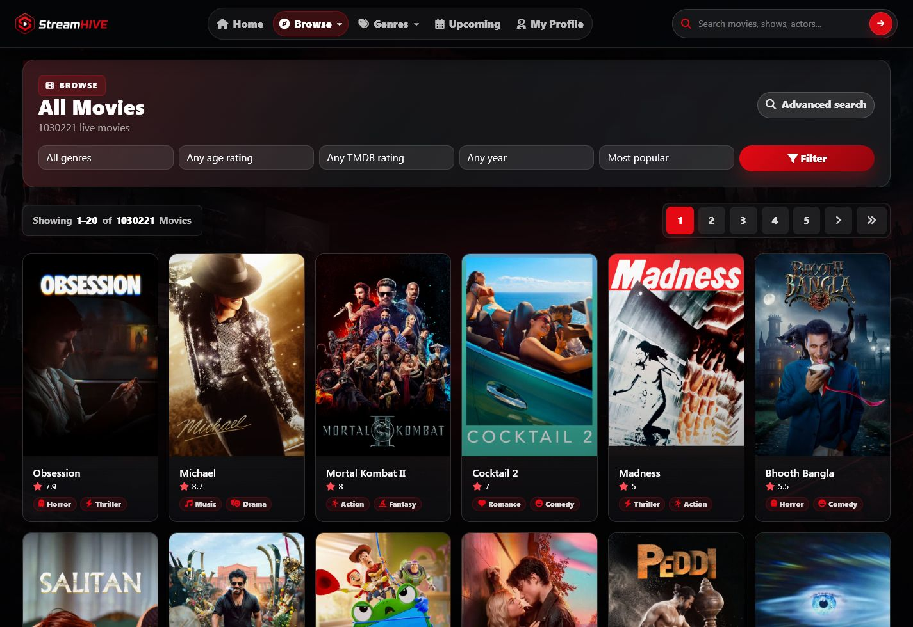
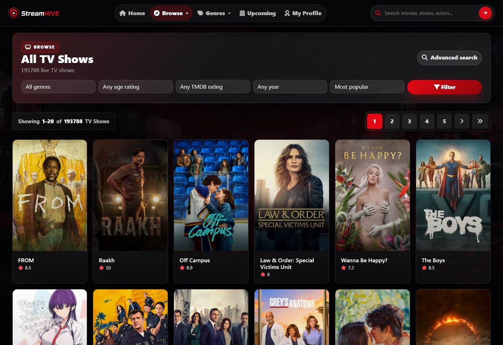
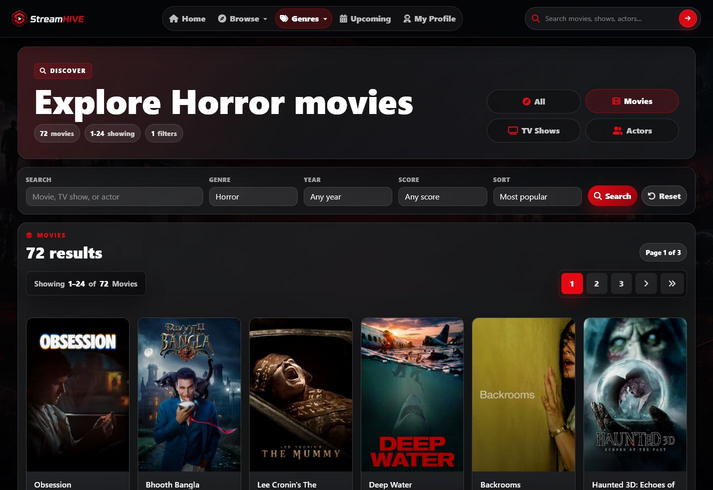
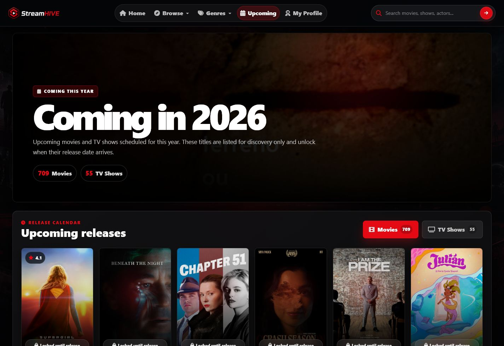
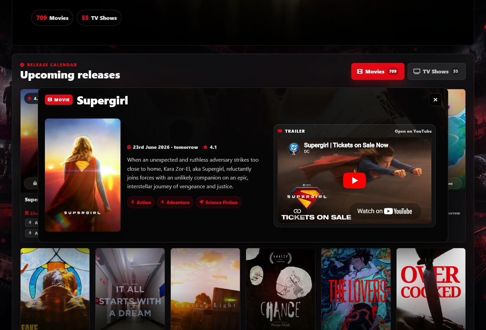
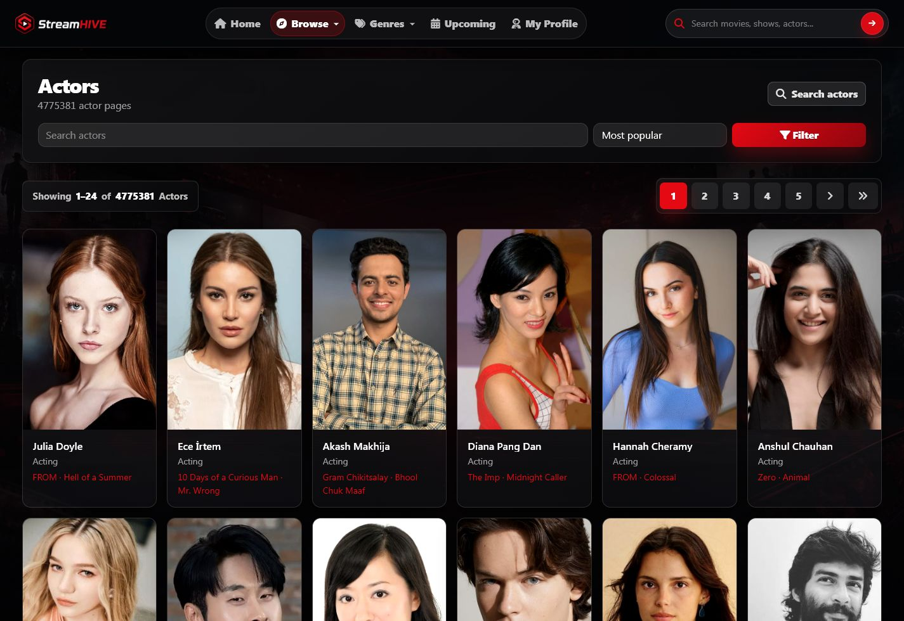
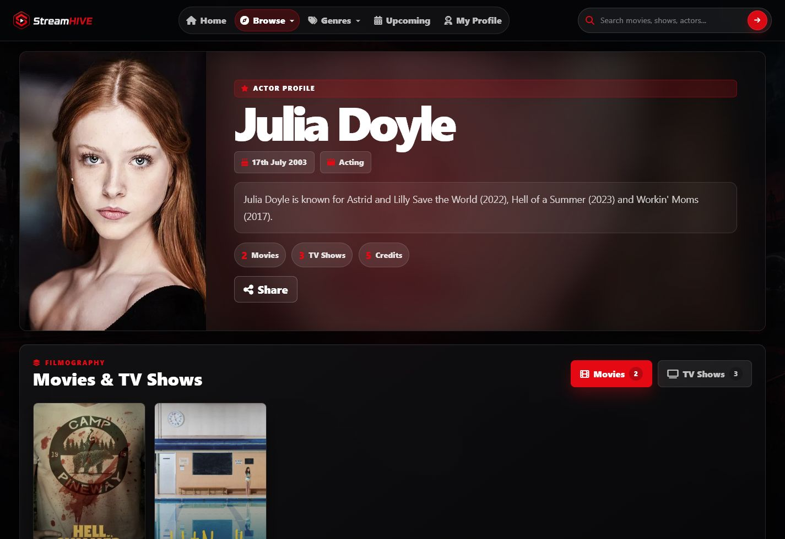
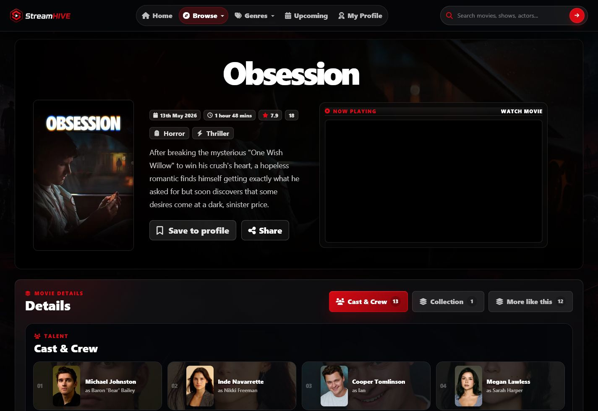

# StreamHIVE 2.5.4

<p align="center">
  
</p>

<p align="center">
  <a href="LICENSE"></a>
  
  
  
  
  
  
  
  
  
</p>

<p align="center">
  <strong>Live site:</strong> <a href="https://streamhive.uk/">https://streamhive.uk/</a>
</p>

**StreamHIVE 2.5.4** is a live TMDB-powered movie and TV discovery app built with PHP. It delivers a polished streaming-service interface with cinematic detail pages, live search, actor profiles, recommendations, local browser profiles, upcoming-release discovery, and configurable embed-player routing.

This version is intentionally **live-only**. It does not require MySQL, SQLite, admin imports, or a local catalogue. Pages resolve against TMDB at request time, keeping the codebase lightweight, portable, and straightforward to deploy.

> This product uses the TMDB API but is not endorsed, certified, or otherwise approved by TMDB.

## Screenshots

| Home | Movies |
|---|---|
|  |  |

| TV Shows | Discovery Filters |
|---|---|
|  |  |

| Coming This Year | Upcoming Modal |
|---|---|
|  |  |

| Actors | Actor Profile |
|---|---|
|  |  |

| Movie Detail |
|---|
|  |

## Highlights

- Live TMDB data for movies, TV shows, seasons, episodes, actors, cast, crew, collections, recommendations, ratings, posters, and backdrops.
- No database required for catalogue data.
- StreamHIVE 2.5 UI refresh with cleaner navigation, release badges, tighter discovery panels, refined poster cards, and a more professional dark-glass finish.
- Movie and TV detail pages with inline player panels, metadata, genres, cast, crew, collections, seasons, episodes, and related titles.
- Upcoming releases page with English-language movie and TV results, runtime caching, pagination, detail modals, and embedded trailers.
- htmx-enhanced browse/search pagination and filtering for smoother server-rendered page swaps.
- Alpine-powered tabs across upcoming releases, actor filmographies, and movie/TV/season detail sections.
- Search and discovery across titles, actors, genres, years, ratings, and score filters.
- Browser-local profile features using `localStorage` for saved titles and recently viewed content, with Day.js recency labels.
- Configurable embed provider with built-in presets and custom URL template support.
- Renameable public site branding through `SITE_NAME` in `.env`.

## Tech Stack

| Layer | Technology |
|---|---|
| Runtime | PHP 8.1+ |
| Routing | Custom lightweight PHP router |
| Data | TMDB API |
| Frontend | Server-rendered PHP views, HTML, CSS, JavaScript, jQuery, htmx, Alpine.js, Day.js |
| UI | Locally served Bootstrap, Font Awesome, Splide |
| Persistence | Browser `localStorage` for profile data |
| Server | Apache/XAMPP with `mod_rewrite`, or PHP built-in server |

## Requirements

- PHP 8.1 or newer
- PHP `curl` extension recommended
- Apache with `mod_rewrite`, XAMPP, or PHP built-in server
- TMDB credentials:
  - v4 Read Access Token preferred
  - v3 API key supported as fallback

No database server is required.

## Quick Start

Clone the repository:

```bash
git clone https://github.com/GingerDev0/StreamHIVE.git
cd StreamHIVE
```

Create your runtime environment file:

```bash
cp .env.example .env
```

Fill in your values:

```ini
TMDB_BEARER_TOKEN=
TMDB_API_KEY=

SITE_NAME=StreamHIVE

PLAYER_PROVIDER=multiembed
PLAYER_MOVIE_URL=
PLAYER_EPISODE_URL=
```

`TMDB_BEARER_TOKEN` is preferred. Keep `.env` private and never commit real credentials. The app requires a real `.env` at runtime and will stop with a clear setup message if only `.env.example` exists.

## Running Locally

### XAMPP / Apache

Place the project in:

```text
C:\xampp\htdocs
```

Make sure Apache rewrite support is enabled. The root `.htaccess` forwards requests into `public/`, and `public/index.php` handles routing.

Open:

```text
http://127.0.0.1/
```

### PHP Built-In Server

```bash
php -S 127.0.0.1:8000 -t public
```

Open:

```text
http://127.0.0.1:8000/
```

## Core Routes

| Route | Description |
|---|---|
| `/` | Home page |
| `/movies` | Movie discovery |
| `/movies/{slug}` | Movie detail |
| `/tv` | TV discovery |
| `/tv/{slug}` | TV show detail |
| `/tv/{slug}/s01` | Season detail |
| `/tv/{slug}/s01/e01` | Episode detail |
| `/actors` | Actor discovery |
| `/actors/{slug}` | Actor profile |
| `/coming-this-year` | Upcoming English-language movies and TV for the current year |
| `/s` | Search and filter page |
| `/profile` | Browser-local saved and recent titles |
| `/ajax/live-search` | Navbar live-search endpoint |
| `/ajax/upcoming-trailer` | Trailer lookup endpoint for upcoming modal |
| `/ajax/coming-this-year-items` | htmx/JSON pagination endpoint for upcoming results |

## Feature Overview

### Live Discovery

StreamHIVE 2.5 resolves listings directly from TMDB discover/search endpoints. Users can browse movies, TV shows, actors, genres, release years, age ratings, score filters, and live search results without maintaining an imported local catalogue.

Browse and search pages use htmx-boosted forms and pagination, so filters and page changes can update the server-rendered result shell without a full-page refresh while keeping normal links and history behavior intact.

### Detail Pages

Movie, TV, season, episode, and actor pages are assembled from live TMDB responses. Detail pages include posters, backdrops, metadata, ratings, genres, overview text, cast and crew, recommendations, and route-aware canonical URLs.

### Coming This Year

The upcoming page fetches available TMDB discover pages for the remaining current-year date range, filters to English-original titles, removes duplicates, and renders tabbed movie/TV grids. Cards open a high-layer modal with poster, release date, rating, genres, overview, and a fitted trailer embed where available.

Upcoming tabs use Alpine.js for lightweight UI state, pagination uses htmx fragments, and Day.js adds relative release timing such as `tomorrow` or `in 42 days`.

### Local Profile

Saved titles and recent history are stored in the browser with `localStorage`. No account system or server-side profile storage is required. Profile cards show Day.js-powered saved/viewed recency labels.

### Frontend Utilities

StreamHIVE keeps frontend dependencies local under `public/assets/vendor` so the app is not dependent on Bootstrap, Font Awesome, Splide, htmx, Alpine.js, or Day.js CDNs at runtime. These utilities are used progressively:

- htmx enhances browse/search filters, pagination, and upcoming-result fragments.
- Alpine.js handles lightweight tab state on public detail and upcoming pages.
- Day.js formats release timing and browser-local profile recency.
- jQuery remains for legacy delegated behavior, live search, profile rendering, and compatibility fallbacks.

### Player Routing

The app builds configurable movie and episode embed URLs from TMDB and IMDb identifiers. Use a built-in provider preset or define fully custom URL templates in `.env`.

## Environment Variables

| Variable | Required | Description |
|---|---:|---|
| `TMDB_BEARER_TOKEN` | Recommended | TMDB v4 Read Access Token |
| `TMDB_API_KEY` | Optional | TMDB v3 API key fallback |
| `SITE_NAME` | Optional | Public website name used in titles, metadata, logo alt text, and sharing |
| `PLAYER_PROVIDER` | Optional | Built-in provider: `multiembed`, `vidsrc-to`, `vidsrc-cc`, or `embed-su` |
| `PLAYER_MOVIE_URL` | Optional | Custom movie embed URL template |
| `PLAYER_EPISODE_URL` | Optional | Custom episode embed URL template |

Custom player templates support:

| Placeholder | Meaning |
|---|---|
| `{video_id}` | TMDB ID when available, otherwise IMDb ID |
| `{tmdb_id}` | TMDB ID only |
| `{imdb_id}` | IMDb ID only |
| `{tmdb_flag}` | `1` when `{video_id}` is TMDB, otherwise `0` |
| `{season}` | Episode season number |
| `{episode}` | Episode number |

## Project Structure

```text
app/
  Controllers/   Page and AJAX request handlers
  Core/          Router, config loader, and view renderer
  Helpers/       URL, slug, image, player, rating, and formatting helpers
  Models/        Repository compatibility layer
  Services/      TMDB client and live catalogue abstractions
  Views/         Layouts, pages, and reusable partials

docs/
  screenshots/   README screenshots

public/
  assets/        CSS, JavaScript, locally served frontend vendors, images, favicon, and metadata image
  index.php      Front controller

.env.example     Safe runtime configuration template
.htaccess        Apache rewrite entry point
README.md        Project documentation
LICENSE          MIT license
```

## Important Files

| File | Purpose |
|---|---|
| `public/index.php` | Route table and front controller |
| `app/bootstrap.php` | Autoloading, helpers, `.env` guard, and debug bootstrapping |
| `app/Controllers/MediaController.php` | Movie, TV, season, episode, listing, search, and upcoming logic |
| `app/Controllers/ActorController.php` | Actor pages and filmographies |
| `app/Services/TmdbClient.php` | TMDB API wrapper and batched request helper |
| `app/Helpers/helpers.php` | Shared formatting, slug, image, rating, site-name, and player helpers |
| `public/assets/js/app.js` | Search, modals, profile state, trailer embeds, and UI behavior |
| `public/assets/css/app.css` | Visual system and responsive styling |
| `public/assets/vendor/` | Local Bootstrap, Font Awesome, Splide, htmx, Alpine.js, and Day.js assets |

## Deployment Checklist

- Keep `.env` private.
- Confirm `.env` exists on the server and is not just `.env.example`.
- Confirm TMDB credentials are valid and not committed.
- Confirm rewrite rules route all requests through `public/index.php`.
- Confirm outbound HTTPS requests from PHP are allowed.
- Review third-party embed providers for legal and terms-of-service compliance.
- Rotate credentials immediately if `.env` is ever exposed.

### Optional Auto Updates

StreamHIVE includes a CLI-only updater that compares the installed `version.txt` with GitHub, downloads the latest `main` archive when GitHub is newer, backs up overwritten files to `storage/update-backups`, and skips private/runtime paths such as `.env`, `storage/`, `vendor/`, and `node_modules/`.

Run manually:

```bash
php scripts/update-from-github.php
```

Cron example:

```cron
*/30 * * * * cd /path/to/StreamHIVE && php scripts/update-from-github.php --quiet >/dev/null 2>&1
```

Use `--check-only` to check for an update without applying it, or `--dry-run` to preview file updates.

## Security And Content Notes

StreamHIVE 2.5 does not host video files. It only builds configurable embed URLs and displays metadata from TMDB. Anyone deploying or modifying this project is responsible for ensuring that enabled providers, embeds, sources, and links comply with applicable law and third-party terms.

Do not commit:

- `.env`
- API tokens or credentials
- Runtime caches
- Local databases
- Logs
- Editor or OS files

## Troubleshooting

### The app says `.env` is missing

Copy `.env.example` to `.env` and fill in your values. The app intentionally refuses to boot without a real `.env` file.

### Pages return 404

- The TMDB item could not be resolved from the slug.
- The item is unreleased or missing a valid release/air date.
- Apache rewrite rules are disabled.
- Requests are not reaching `public/index.php`.

### TMDB requests fail

- Check `.env`.
- Confirm your TMDB token or API key is valid.
- Confirm PHP can make outbound HTTPS requests.
- Confirm `curl` is enabled if your environment requires it.

### Images are missing

- TMDB may not have a usable poster, profile image, or backdrop for that item.
- Remote image requests may be blocked by the network or browser.
- Some grids intentionally filter out titles without usable posters.

## Credits

| Credit | Source |
|---|---|
| Metadata and imagery | TMDB API |
| Icons | Font Awesome |
| UI framework | Bootstrap |
| Carousel UI | Splide |
| Progressive AJAX | htmx |
| Lightweight UI state | Alpine.js |
| Date formatting | Day.js |
| Original project | GingerDev0 / StreamHIVE 2.5 |

## License

StreamHIVE 2.5 is released under the MIT License. See [LICENSE](LICENSE) for details.


